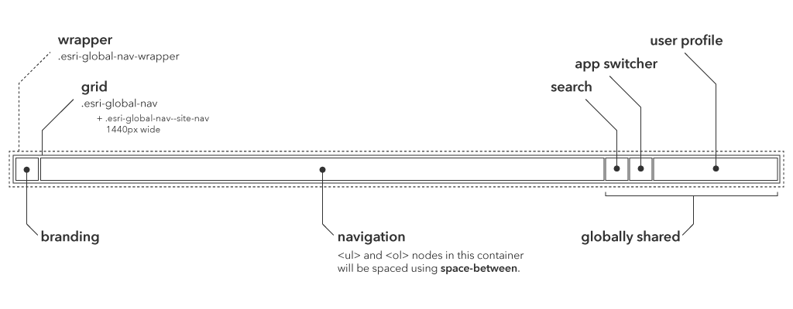

# Esri Global Navigation [][Esri Global Navigation]

[![Build Status][cli-img]][cli-url]
[![Licensing][lic-image]][lic-url]
[![Changelog][log-image]][log-url]

[Esri Global Navigation] is the presentation layer of the top-level navigation for Esri's web pages and SAAS applications. It consists of the markup (HTML), styles (CSS), and functionality for UI interactions.


The primary reasons for this component are to achieve greater platform-wide alignment and reduce the amount of duplicated work any given developer needs to do.

Secondary reasons are to encourage shared ownership and allow for rapid iterations.

## Usage

We recommend using **Esri Global Navigation** with a package manager, as it is the most manageable approach and reduces duplication of work.

```sh
npm install ArcGIS/esri-global-nav --save-dev
```

Build the source of this component into a `dist` directory.

```sh
npm start dist
```

Alternatively, host the `dist` directory as a local website at [http://localhost:8080](http://localhost:8080).

```sh
npm start host
```

## Structure



The component has three sections:

* Branding
* Navigation
* Globally-shared

The **Navigation** section has the greatest flexibility.  That being said, the default styles applied to this section should require little and possibly no customization to address individual needs.

This section also includes some nice styles and animations for the sub-nav elements.

The **Branding** section contains styles for SAAS applications which are distinct from site pages.

The **Globally-shared** section should receive little to no customization within your implementation.  It contains the following:
* Search link
* App Switcher
* User Profile and profile dropdown

#### Tablet


SAAS Apps
* Nav items are condensed and hidden under the ellipses icon and lives on the right.
* App name/Project name remains
* Logo remains (takes you to dashboard)

Website
* Nav items are condensed and hidden under the burger icon and lives on the left.
* Logo remains (takes you home)

## Integrations

Integrations for frameworks such as [Ember] and [AngularJS] would be a great addition and contributions are welcome.

## Contributing

Contributions are welcome in all forms: issues, pull requests, concepts, inquiries, etc.

[Esri Global Navigation]: https://github.com/ArcGIS/esri-global-nav
[Ember]: http://emberjs.com/
[AngularJS]: https://angularjs.org/

[cli-url]: https://travis-ci.com/ArcGIS/esri-global-nav
[cli-img]: https://api.travis-ci.com/ArcGIS/esri-global-nav.svg?token=mqvp34VgHUamyk5XDa9d
[lic-url]: LICENSE.md
[lic-image]: https://img.shields.io/badge/license-CC0--1.0-blue.svg
[log-url]: CHANGELOG.md
[log-image]: https://img.shields.io/badge/changelog-md-blue.svg
